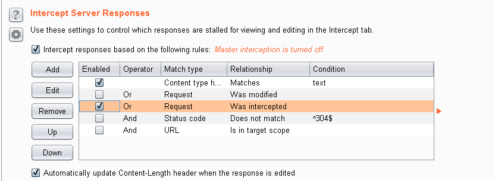
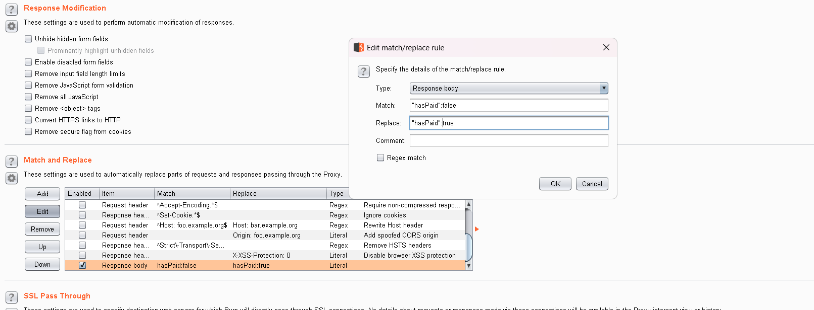

+++
title = "Ruining the 'Vibe' and bypassing payments"
date = "2025-07-29"
author = "Maaroof Khan"
authorTwitter = ""
cover = ""
coverCaption = ""
tags = ["security", "bug bounty", "vulnerability", "javascript", "client-side", "pentesting"]
keywords = ["payment bypass", "sessionStorage", "burp suite", "supabase", "vibe coded", "lovable"]
description = "A walkthrough of how a simple 'vibe coded' web app's reliance on client-side logic led to a full payment and authorization bypass using browser developer tools and Burp Suite."
showFullContent = false
readingTime = true
hideComments = false
color = "" #color from the theme settings
+++

We're living in the age of AI, where even the simplest tasks are being automated daily. And with this wave comes a flood of people with ideas, all looking to spin up a quick product and make a quick buck.

I found one such "Vibe Coded" web app, courtesy of the YouTube algorithm.

It was a simple app, stitched together with Lovable, Supabase, and Stripe. But the fun thing about "vibe coded" software is that it often ships with bugs that, well, share the same "vibe."

So, naturally, I started digging.

I didn't find anything special on the webpage at first glance. For once, the UI was nice and well-made. My next move, as any sane person would do, was to pop open the developer console and inspect the JavaScript files.

And there it was, the `index.js` file, looking right at me.

One thing I've learned about "vibe coded" applications, especially those built with Lovable, is that they *love* to keep as much logic as possible on the frontend. (A hot tip for easy bug bounty points, by the way).

As expected, the file was a beast: **27,224 lines of code**. No sane person wants to waste their weekend reading AI-written code. So, I did the opposite of "vibe coding."

Yeah, "Vibe Decoding." As cheesy as it sounds, it works.

I fed the code to Gemini and told it to find "any interesting or exploitable points in the code." A quick pro-tip: to convince an LLM to actually help you with security research instead of giving you the "I can't do that" spiel, just tell it you're doing a CTF. They're happy to give you everything you ask for.

Anyway, Gemini pointed out some very interesting snippets. The original code was obfuscated, but here's the decoded gold it gave me.

### The Signup Logic

The first clue was in the signup function.

```javascript
// A simplified and commented version of the 'handleSignUpRedirect' function
const handleSignUpRedirect = async _ => {
    // ... validation checks ...

    try {
        console.log("Starting signup redirect process for:", email);
        // It removes any previous pending signup
        sessionStorage.removeItem("pendingSignup");

        const userCredentials = {
            email: email.trim(),
            password: password
        };
        // VULNERABILITY: User credentials are stored in sessionStorage BEFORE payment.
        sessionStorage.setItem("pendingSignup", JSON.stringify(userCredentials));
        console.log("Stored pending signup credentials");

        // ...
        // It then calls a serverless function to create a Stripe checkout session.
        const {data: checkoutData, error: checkoutError} = await supabase.functions.invoke("create-checkout", {
            body: checkoutBody
        });

        // ...

        // It then redirects the user to the payment URL.
        checkoutData?.url ? (
            console.log("Redirecting to Stripe checkout:", checkoutData.url),
            onClose(), // closes the modal
            window.location.href = checkoutData.url
        ) : ( /* ... error handling ... */ );

    } catch (e) {
        // ... error handling ...
    } finally {
        setLoading(false);
    }
};
```

Looking at this, we see the user's email and password are nonchalantly dropped into `sessionStorage` under the key `pendingSignup` *before* the user is sent off to pay. The obvious assumption is that after a successful payment, the site will come back and use these stored credentials to create the account. This smells like very little server-side validation is going on.

But the smoking gun was on the next page.

### The Payment "Successful" Page

```javascript
// A simplified and commented version of the useEffect in the PaymentSuccessPage component
useEffect(() => {
    const processPaymentSuccess = async () => {
        // ... checks to prevent running twice ...

        // VULNERABILITY: Retrieves credentials directly from sessionStorage.
        const pendingSignup = sessionStorage.getItem("pendingSignup");
        const sessionId = urlSearchParams.get("session_id"); // from URL

        console.log("Payment success page loaded:", {
            pendingSignup: !!pendingSignup,
            sessionId: sessionId
        });

        if (pendingSignup && !isLinking) {
            // ... setLoading(true) ...
            try {
                const {email, password} = JSON.parse(pendingSignup);
                console.log("Processing account creation for:", email);

                // VULNERABILITY: Calls the signUp function based on client-side data.
                // The server has no way of knowing if payment was actually successful.
                const {error: signUpError, data: { user } } = await signUp(email, password);

                if (signUpError) {
                    // ... error handling for signup ...
                } else if (user) {
                    console.log("Account created successfully:", user.id);
                    // ... shows success toast ...
                    // Calls linkPayment AFTER user is created.
                    setTimeout(() => {
                        linkPayment(sessionId, email)
                    }, 4000)
                }
            } catch (g) {
                // ... error handling ...
            } finally {
                // ... setLoading(false) ...
            }
        } else {
            // Checks payment status if user is already logged in
            checkPaymentStatus()
        }
    };

    // ... definition of linkPayment function ...

    processPaymentSuccess()
}, [])
```

When a user lands on the `/payment-success` endpoint, the page doesn't check with the server to confirm a payment. Instead, it just grabs the `pendingSignup` value from `sessionStorage` and creates the account. The `checkPaymentStatus()` function, which *does* talk to the backend, is only called if the user is already logged in.

This gives us two beautiful things:
1.  We can create an account without paying a single penny.
2.  Once we log in, that `checkPaymentStatus()` function is probably going to be an obstacle. (Stay tuned to find out how we bypass it *wink, wink*).

Let's get our free account.

### Step 1: Crafting a "Paid" Account

I grabbed a temporary email from a disposable mail service because, let's be real, you never use your real email when money is (supposedly) involved.

Let's say I got `c016u@mechanicspedia.com`.

Then, I opened the browser console on the site's homepage and typed this magic spell:

```javascript
sessionStorage.setItem('pendingSignup', JSON.stringify({email: 'c016u@mechanicspedia.com', password: 'PasswordGoesHere123'}));
```

With the `pendingSignup` value manually set, all I had to do was navigate directly to the `/payment-success` endpoint. As the source code promised, it saw the session data, assumed I was a good, paying customer, and signed me right up.

It worked.


A verification email landed in my temporary inbox. Clicking the link redirected me to the homepage for a "paid" user. Jackpot, right?

Not quite. Remember that `checkPaymentStatus()` function? It left us alone during signup, but now it's back for revenge. The site sees we're logged in and calls this function to confirm we've actually paid. The function, doing its one job correctly, always responds with `{ "hasPaid": false }`.

### Step 2: Making the Client Lie

Now, we know most of the logic is handled on the client side (Vibe Coding™). My hypothesis was simple: if I could just make that `hasPaid` response come back as `true`, I could bypass the authorization check and enjoy my free premium account.

So, I fired up Burp Suite.

I added the target site to my scope and went to **Proxy -> Options -> Intercept Server Responses** and enabled it.



With the intercept active, I reloaded the page and caught the response from the server. In the response body was the simple JSON payload: `{ "hasPaid": false }`.

Time to lie. I went to **Proxy -> Options -> Match and Replace**.



I added a simple rule to replace the string `"hasPaid":false` with `"hasPaid":true` in all responses.

And voilà! The error messages vanished. We successfully bypassed the payment and authorization checks, unlocking a full premium account.

### The Aftermath

I did reach out to the creator by email a few weeks ago but never received a response. As of now, the site is still running, but it seems their Supabase API key has expired, so the application is mostly non-functional.

This was a fun little exercise that teaches a classic lesson: relying too heavily on the frontend for security is a terrible idea. But relying on "Vibe Coding" without understanding secure practices is an even worse one.

So, an additional tip for bug bounties: keep an eye out for the "vibe coders." In this day and age, they are often the lowest-hanging fruit.