+++
title = "SOC HomeLab: Using Wazuh and Docker to create an interactive home lab"
date = "2026-05-26"
author = "Maaroof Khan"
authorTwitter = ""
cover = ""
coverCaption = "Wazuh instance running on docker with an attack and victim machine"
tags = ["RedTeaming", "BlueTeaming", "SOC", "Linux", "HomeLab"]
keywords = ["SOC", "HomeLab", "Docker", "Wazuh", "SIEM", "CyberSecurity"]
description = "A walkthrough on how to setup a homelab in easy steps using docker"
showFullContent = false
readingTime = true
hideComments = false
color = ""
+++

Hello my friend! Been a long time since I posted here, thinking of starting again.
That aside, today we will be creating a homelab using `docker` and `wazuh`. Labs like these are a great tool for learning and practicing major *Red Teaming* and *Blue Teaming* skills. So without any further chitchat, let us get into it right away!

### Lab architecture:
- Kali Linux (Attacker)
- Ubuntu (Victim) running `OWASP juice-shop` as a vulnerable service
- Nginx service on ubuntu acting as a reverse proxy (Mimicking real world scenario)
- Wazuh (Manager, Indexer, Dashboard) as SIEM
- Suricata to monitor network traffic through wazuh

### Requirements:
- Docker/Docker Desktop
- WSL (If on windows)
- Git

Once you have gone through the architecture and requirements and understand how we might be configuring things, we can move ahead!

## Step 1 - Initial Lab Setup

Start by cloning Wazuh's git repository:

```bash
git clone https://github.com/wazuh/wazuh-docker.git -b v4.14.5 
# Feel free to change the version to a specific or latest one
```

Now time to start the setup for our lab. On a windows machine the official wazuh documentation recommends setting `vm.max_map_count`. To do that we can go to `C:\Users\<YourUsername>` and find/create the file `.wslconfig`. Add this line at the end of it:

```bash
kernelCommandLine = "sysctl.vm.max_map_count=262144"
```

After that shutdown wsl using:
```bash
wsl --shutdown
```

And restart docker desktop. Finally we are ready to start the actual lab setup. Go to the wazuh git repo we just cloned:
```bash
cd wazuh-docker/single-node
```

Since we are only setting up a home lab we will use the single node which contains 1 Indexer, 1 Manager and 1 Dashboard. Ideal for our small lab environment. Once we are inside our directory we can start by opening the `docker-compose.yml` file and modifying it for our needs.

Firstly we need to setup our network which these containers will use to communicate. In the `docker-compose.yml` file scroll to the very bottom and add this:

```yaml
networks:
  lab-net:
    driver: bridge
    ipam:
      config:
        - subnet: 10.0.0.0/24
```

Here we are defining a custom bridged network with the subnet `10.0.0.0/24`. This will be the network on which our containers will communicate with each other. Now we will assign all the wazuh elements a fixed IP to avoid any future confusion and keep things organized.

Each wazuh service (Manager, Indexer and Dashboard) will get a unique IP that we will assign, find these services in the file and add this to the very end of each service:

```yaml
# Wazuh manager's config
networks:
    lab-net:
        ipv4_address: 10.0.0.2

# Wazuh indexer's config
networks:
    lab-net:
        ipv4_address: 10.0.0.3

# Wazuh dashboard's config
networks:
    lab-net:
        ipv4_address: 10.0.0.4
```

Now we know that Manager is on `10.0.0.2`, Indexer on `10.0.0.3` and Dashboard on `10.0.0.4`. We are done with the boring setup, now to configure our attack and victim machines. Add these after all the wazuh services:

```yaml
kali:
    image: kalilinux/kali-rolling
    container_name: attackBox
    cap_add:
      - NET_ADMIN
      - NET_RAW
      - SYS_NICE
    tty: true
    stdin_open: true
    networks:
      lab-net:
        ipv4_address: 10.0.0.5

ubuntu:
    image: ubuntu:22.04
    container_name: victimBox
    cap_add:
      - NET_ADMIN
      - NET_RAW
      - SYS_NICE
    tty: true
    stdin_open: true
    networks:
      lab-net:
        ipv4_address: 10.0.0.6
    ports:
      - 5050:80 # We will run juice-shop through nginx to get better logs
```

Time to breakdown all the complex jargon that we see above. We first define the image we want to use, `kalilinux/kali-rolling` for our `attackBox` and `ubuntu:22.04` for our `victimBox`. That is pretty straight forward, next we need to have some capabilities in both the machines so that `suricata` can monitor the network without any issues. We define them using `cap_add`, starting with `NET_ADMIN` giving networking administrating rights, `NET_RAW` letting us capture raw packets and `SYS_NICE` for priority management.

Then we get to `tty: true` and `stdin_open: true`, we are just telling the containers to stay active and keep standard input open so we can get interactive shells later. On the `ubuntu` machine we also have a `ports` section, because we will be running `OWASP Juice Shop`, a vulnerable web app on it and we want to access it from our host machine, so we expose the port `5050` on our host machine which maps to the port `80` on the container, that is what the `5050:80` means. We are doing this because we will run this app through nginx so we get proper `apache` logs and that can be fed and viewed by Wazuh. And we also assign them unique IPs like the wazuh services.

We are now done with the configuration part, you can skip this by downloading this `yml` file from [my repo](https://github.com/Maaroof-Khan10/Docker-Wazuh-HomeLab/blob/main/docker-compose.yml) directly if you just want to follow along or need a reference point to compare your configs. We can now start these containers but first we need to finish the certificate generation as per Wazuh's documentations. Go ahead and run this in the terminal:

```bash
docker compose -f generate-indexer-certs.yml run --rm generator
```

After this is finished you have generated the necessary certificates and now we are ready to start our lab atlast. Run this command to start the services in the background:

```bash
docker compose up -d
```

It will take a while to download everything you need but after a while you will see all the services have started, to verify run:

```bash
docker ps
```

## Step 2 - Setting up the victim machine

You should see that all the services are up and running! To check if Wazuh is running, open a browser and go to `https://localhost`. If you did everything correctly you should see a Wazuh dashboard running (Sometimes your browser might give a warning, click advance and go ahead). Login using the default username and password which is `admin:SecretPassword`. You should now be able to see the dashboard in all of it's glory.

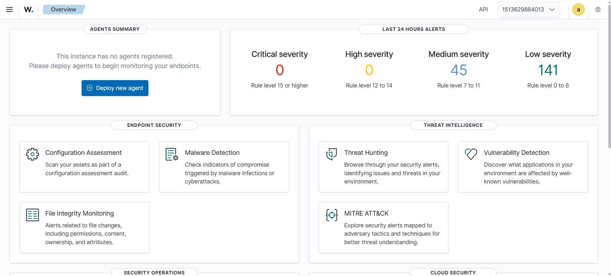

We will be using this dashboard shortly but before that let us configure our victim and get it ready.
We will:
- Ping all the machines to see if we are connected.
- Install and start `OWASP Juice Shop`.
- Install `nginx` and configure it to run juice-shop as proxy.
- Install and configure `Suricata`.
- Install and configure `Wazuh agent`.

Starting with Pinging and Juice Shop configuration, let us open the interactive shell of your ubuntu:

```bash
docker exec -it victimBox bash
```

You should see that you are already in a root terminal. Start by updating apt and downloading a few tools we will need:

```bash
apt update && apt install curl git nginx nano iputils-ping -y
```

We will now ping our attacker machine to see if we are actually connected or not:

```bash
ping -c 4 10.0.0.5
# You can try to ping other wazuh services too
```
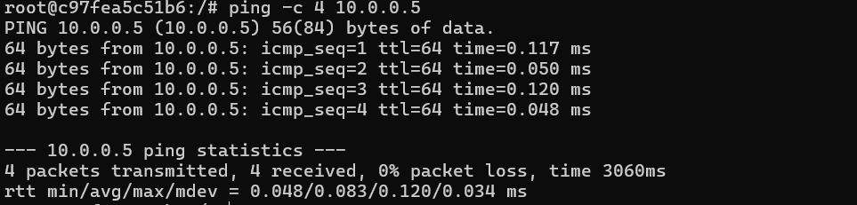

You should see the replies coming from other machines! We successfully implemented a small lab network! Now onto the actual installation. We will setup `nodejs` and install/run a `juice-shop` instance:

```bash
# The installation documentation of nodejs 
# can be found on https://nodesource.com/products/distributions
curl -fsSL https://deb.nodesource.com/setup_24.x | bash -
apt install nodejs -y
node -v # To check if it is installed
# Now time to clone the repo
git clone https://github.com/juice-shop/juice-shop.git --depth 1
cd juice-shop
npm install # This will take a while
# We need to start it as a background service so:
npm start > /var/log/juice-shop.log 2>&1 & 
# The log file will be usefull to feed to wazuh
```

If you followed along perfectly you must now have a web page running on `10.0.0.6:3000`, but we are not done yet. We will now configure nginx to proxy our web app. First use `nano` and open `/etc/nginx/sites-available/default` and replace everything with this:

```
server {
    listen 80;
    location / {
        proxy_pass http://localhost:3000;
        proxy_set_header Host $host;
        proxy_set_header X-Real-IP $remote_addr;
        proxy_set_header X-Forwarded-For $proxy_add_x_forwarded_for;
    }
}
```

Now run the following commands to check and restart `nginx` and we are almost done with configuring `OWASP Juice-Shop`:

```bash
nginx -t # To check if the configuration is proper.
service nginx restart
```

You should now be able to open a browser, go to `localhost:5050` and see the `OWASP Juice-Shop` in all it's glory!

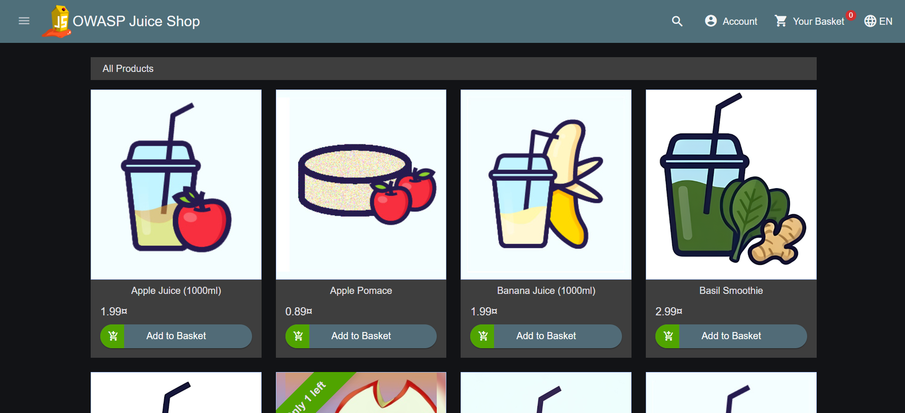

## Step 3 - Suricata configuration

After this we will configure `Suricata` so that all our network traffic is monitored. To install it run:

```bash
apt install software-properties-common -y
add-apt-repository ppa:oisf/suricata-stable -y
apt update
apt install suricata -y
```

Once everything is installed, we will update the threat rules to the latest version:

```bash
suricata-update
# Also run this to see your interface (Would most probably be eth0)
apt install iproute2 -y
ip addr
```

Usually suricata's config is set to eth0 by default but, just to check, open `/etc/suricata/suricata.yaml` with `nano` to verify:

```yaml
# The af-packet should be set to eth0 or whatever your interface name is
af-packet:
  - interface: eth0
```

After that we check if the configuration is proper by running:
```bash
suricata -T -c /etc/suricata/suricata.yaml -v
```

Once it is loaded we can go ahead and start `suricata` in the background:
```bash
suricata -D -c /etc/suricata/suricata.yaml -i eth0 
# Replace with your specific interface name
```

All our network traffic data is now being logged and we will send it to wazuh soon.

## Step 4 - Wazuh agent setup

The final step is here, setting up the wazuh agent so that we can see all the logs in the dashboard. Follow these commands:

```bash
apt install wget -y
wget https://packages.wazuh.com/4.x/apt/pool/main/w/wazuh-agent/wazuh-agent_4.14.5-1_amd64.deb 
# Replace with the version you are using
# Can also use the "Deploy new agent" on the dashboard 
# to get the version or command needed
apt --fix-broken install -y # Optional but recommended to run
# Run the --fix-broken command if dpkg gives an error.
dpkg -i ./wazuh-agent_4.14.5-1_amd64.deb # To install the agent
```
The installation part is done, now the fun part of configuration. Once this is done we will be ready to start monitorting. Use `nano` to open the config file at `/var/ossec/etc/ossec.conf`. Inside the `<client>` tag make sure the server manager IP is set to `10.0.0.2` and the `enrollment` is added properly as shown in the screenshot. 

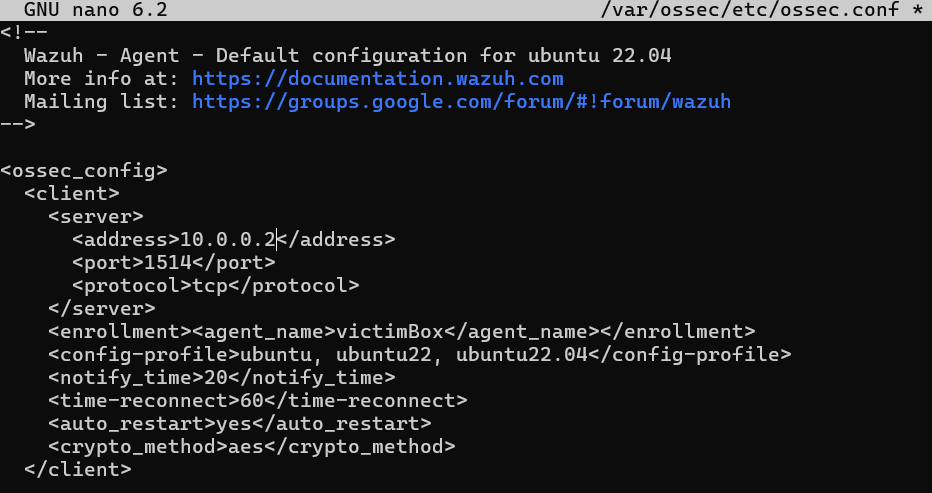

It is now time to add all the log files we have. Scroll to the botoom of the `.conf` to find the `Log Analysis` section, here we will add our custom logs. Add these:

```xml
<!-- Suricata log files -->
<localfile>
  <log_format>json</log_format>
  <location>/var/log/suricata/eve.json</location>
</localfile>

<!-- Nginx log files -->
<localfile>
  <log_format>syslog</log_format>
  <location>/var/log/nginx/access.log</location>
</localfile>

<localfile>
  <log_format>syslog</log_format>
  <location>/var/log/nginx/error.log</location>
</localfile>

<!-- Juice-Shop log file -->
<localfile>
  <log_format>syslog</log_format>
  <location>/var/log/juice-shop.log</location>
</localfile>
```

Once these are added we are finally ready to launch our agent, run:

```bash
service wazuh-agent start
```

After that when you go to the wazuh dashboard you would be able to see that your machine is online .

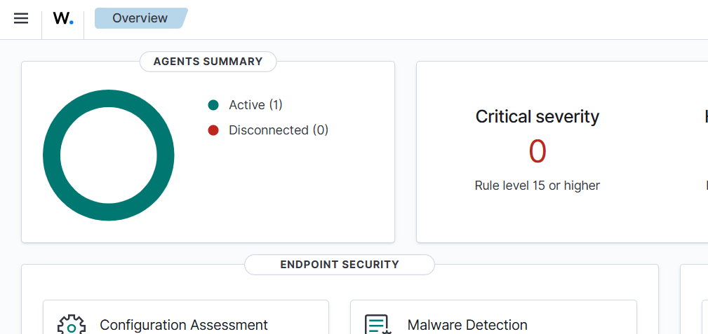

Clicking on the chart will show you all the available agents, like this:

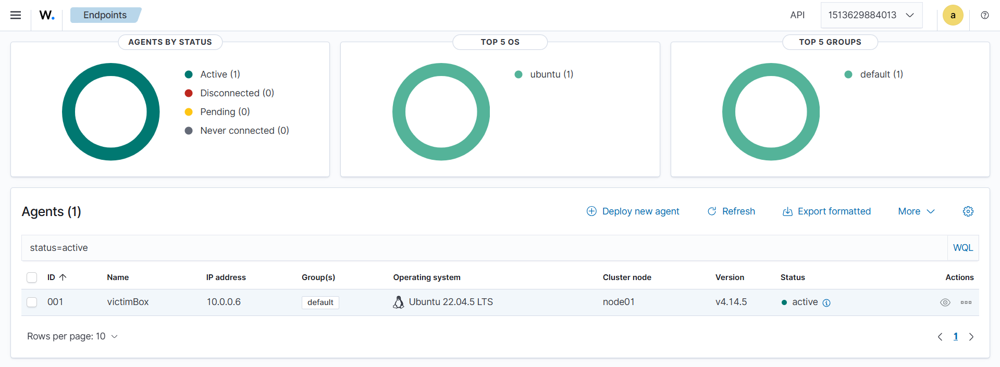

Clicking on it will then show you all the stats and logs in detail:

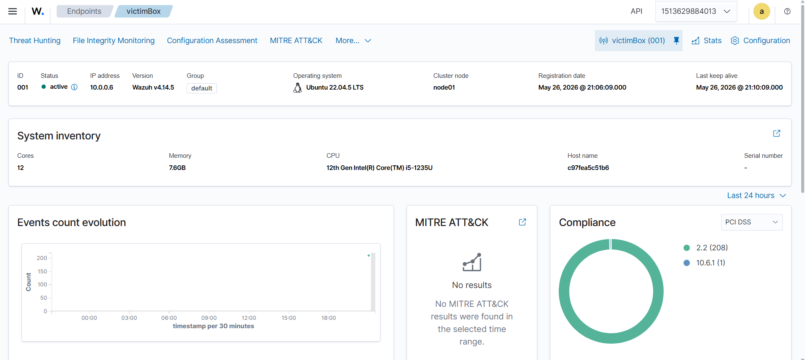

## Step 5 - A fake attack simulation

To perform a basic check and to see if our wazuh agent is sending logs we will run a `nmap` scan using our attack machine to see if it gets logged. To do this exit the victim container on terminal and enter the attack terminal:

```bash
exit # To exit the victimBox
docker exec -it attackBox bash
# Install nmap
apt update
apt install nmap -y
# If this gives an error, run this and it should be fixed
# most probably
apt update --fix-missing
apt install nmap -y
# Run an aggressive scan to check
nmap -A 10.0.0.6 # Our victim's IP
```

On the Wazuh dashboard, go to `Threat Hunting`, you will see pie charts of all the recent logs. We can already see that `Suricata` has logged some data, confirming that our lab is successfully working!

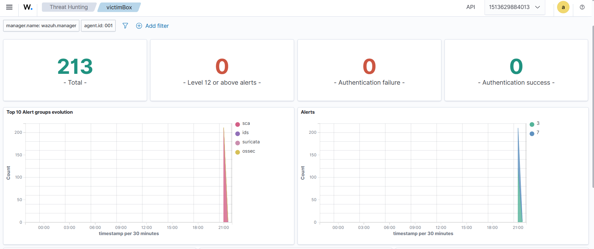

To see the detailed logs, we will go to `Events` tab in `Threat Hunting`. We can already see a lot of activity has been logged and `Suricata` already detected `NMAP` as a suspect! Our lab works as intended!

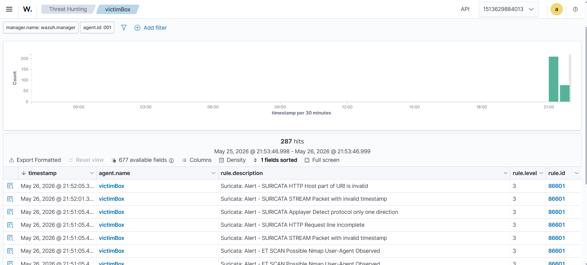

Clicking on an entry will show us a more detailed view, lets check if the source of the attack is shows as `10.0.0.5 (attackBox)`

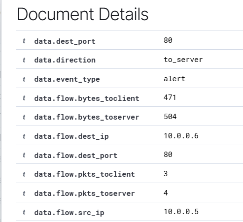

And this confirms that our `Kali` machine was the one running the `nmap` scan! 

You can even set a wazuh agent on the attacker machine if you want to, just follow the previous steps as it is. Keep in mind that we are not setting `juice-shop` and `nginx` on the attack machine! So only follow the steps for `suricata` and `wazuh-agent`. You should then see both of the machines online in your `Endpoints` tab:

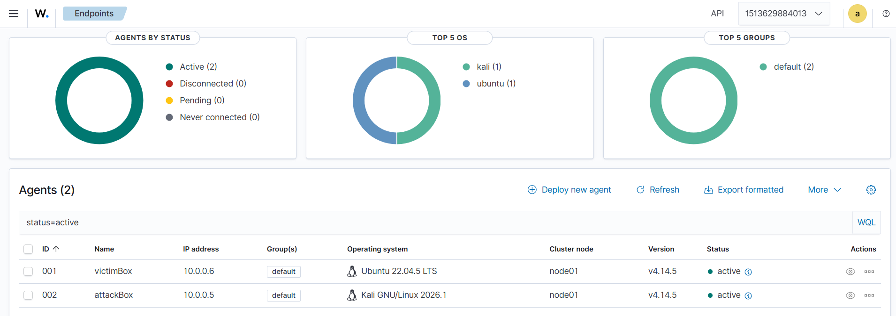

## Conclusion

This lab covers the configuration, setup and usage of an almost real-life `SIEM` environment. All the things covered here are a great actual practical skill that is needed daily in `SOC` and `Red Teaming` operations. Thank you for reading and following this walkthrough and happy hacking!